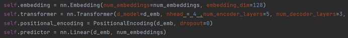
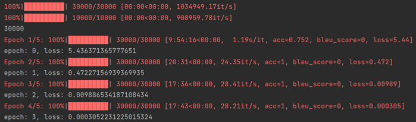

# 自然语言处理实践作业三

本次实践作业基于数据集ROCStories，实现故事生成任务，使用故事的第一句来生成后面的四句。在任务一中，我使用了transformer模型来进行训练，在任务二中，我调用了gpt2进行微调。

# 一、数据处理

本次任务使用的数据集为ROCStories，是英文小故事，每一个故事由五句话构成，每句话10词左右，涵盖多个领域话题。

数据处理分为以下两个步骤：

1. 划分input和label，取决于任务要求而有所不同

2. 将数据tokenize，分词为token,从token转为id

## 1.1划分input和label

根据后续网络结构的不同，我有三种划分数据集的方式：

a) 序列->token：这对应任务一的第一种方法，将文本生成任务转化为预测任务，使用历史上若干长度的序列，来预测下一个词语，这种方式要求仅使用encoder。


b) 输入序列->目标序列：这对应任务一的第二种方法输入的是prompt，输出的是target，在本任务中，可以用每个故事的第一句作为prompt，后面四句作为target来训练。


 

c) 自回归序列：这对应gpt2微调任务，input和label仅错位一个token，输入序列，输出序列，用当前词的前面部分预测当前词，同时label和input计算loss时要移一位，这种方法只需要一个sequence，不必特意区分input和label。


 

## 1.1数据tokenize


 我使用GPT2Tokenizer来对数据进行tokenize处理


GPT2Tokenizer的vocab中共含有50256个token。采用BPE的方式对英文进行分词并token化，会自动把text首尾加上"[CLS]"和"[SEP]"

 查看数据情况：train数据集中，共有30000条数据，一个句子最长的token是107个，而val数据集中，共有10000条数据，最长的为85个token。


# 二、任务一：基于Transformer实现故事生成

## 2.1 encoder分类器方式


 将故事生成问题转化为预测任务，使用历史上若干长度的序列，来预测下一个词语，这种方式要求仅使用encoder


模型输入：sequence，(batchsize, seq_len)

模型输出：token,(seq_len, emb)

模型loss：one-hot编码的out_token与label_token进行crossEntropyLoss

然后通过一个torch.mean和linear(emb, vocab_size)：


 最终输出为一个vocab_size 维度的向量，是最后预测token的logits


 训练模型：


## 2.2 encoder-decoder生成器方式


 输入序列->目标序列：输入的是prompt，输出的是target，在本任务中，可以用每个故事的第一句作为prompt，后面四句作为target来训练,同时使用encoder和decoder



模型输入：input_sequence，(batchsize, seq_len_in)，以及tgt-sequence

模型输出：out_sequence，(batchsize, seq_len_out)，与tgt-sequence形状相同。

模型loss：one-hot编码的out_sequence与tgt-sequence进行crossEntropyLoss

这里模型输入时也要同时输入tgt-sequence，以便在推理时，循环中将模型自己的输出也再次输入decoder，进行自回归生成。


More Actions
 但是注意输入的tgt与目标tgt之间存在一位的错位。


 而模型同时输入src和tgt，就需要防止tgt生成时参考序列后的内容，所以需要mask掉靠后的token，使得每个token生成时只能参考前面的token，使用nn.Transformer.generate_square_subsequent_mask 函数，该函数用于生成用于 self-attention 操作的下三角形状的 mask。这个 mask 可以在 Transformer 模型的 decoder 中使用，以防止当前位置之后的信息泄漏到当前位置：


 模型训练，超参数：


训练过程如下：


 

## 2.3 解码和模型评估

**模型生成**

decode函数接受模型、输入序列 input_sequence、最大生成长度 max_length 和温度参数 temperature 作为输入。函数返回一个生成的文本序列。

在生成过程中，新输出的token不断被补充到tgt中，以便实现自回归生成


 采用温度采样算法来确定输出的token：


temperature 参数通常用于调整生成文本的多样性。较高的温度值会增加输出的随机性，而较低的温度值会减少输出的随机性，使生成更加确定性。

**模型评估**


 模型评估方法采用BLEU，比较候文和参考文里的 n-gram 的重合程度


使用out和label参考对比，每一个batch作一个对比，使用test数据集来检测：

比对encoder模型和encoder-decoder模型，定义temperature=1:


encoder模型最终的BLEU评分为**0.0107**


encoder-decoder模型的最终BLUE评分为**0.0324**


**结果分析**

Encoder模型的效果远不如encoder-decoder，因此接下来只分析encoder-decoder：

encoder-decoder模型的输出仍然不尽如人意：temperature=1时：


 temperature=0.1时：


可以看到在越确定性输出的情况下，模型更倾向于输出’.’，这是因为训练数据中’.’最多，所以模型陷入了局部最优，为’.’赋予更高的概率以便获得尽可能高的acc。


如果只使用一个句子来训练，使模型过拟合：模型的acc可以达到1



这时测试模型输出,如下所示，可以完美复现第一句故事的后面内容,证明了encoder-decoder模型结构的合理性


但是想要使模型过拟合，在上面的训练数据中看到，至少要30000个epoch，说明在目前有限的时间内，transformer模型的训练的轮数还是不够的。

# 三、任务二 基于GPT-2实现故事生成

## 3.1 zero-shot

使用from transformers import GPT2Tokenizer, GPT2LMHeadModel来导入gpt2的分词器和模型。


 解码使用beam-search:


 此时模型只能重复已有的内容。


 

## 3.2模型微调

在gpt2中，输入要处理成"[CLS] [SEP]商品文案[SEP]"的格式Labels 通常输入 input_ids，用于计算 loss

观察GPT2LMHeadModel的源码可以发现：


 另外outputs为'CausalLMOutputWithCrossAttentions' object


 已经包含了loss，所以可以直接用，来计算


 

所以在训练的代码中可以直接用


 

### 方法一：prompt方法


模型input为第一句，label为后续的文本


 训练过程如下：


 但是生成的结果并不好：


同样出现了反复生成同一个词的情况，所以这一方法仍然需要改进

 

### 方法二：梯度累积

 使用梯度累积法，在调用优化以执行梯度下降步骤之前，它将对几个操作的梯度求和。然后，它将总数除以累积的步骤数，以获得训练样本的平均损失。 这意味着计算要少得多，利用pack_tensor函数实现这一点：


 体现在训练过程中，就是将一个批次的tencor合并，梯度求和之后，再backward()


 

### 方法二：部分解冻


 部分解冻方式为将模型起始的一些层的权重保持不变，冻结住，重新训练后面的层，得到新的权重：


将这一部分代码合并到上面的梯度积累方法中，将两种方法合并进行训练：

训练过程如下：


最终load保存的模型来检测：

输入为：Every weekend the Jefferson's go to the park. 


输出内容为：

```
Every weekend the Jefferson's go to the park.

They go to the park to play.

They play a lot of games.

They play a lot of games.

They play a lot of games. <|endoftext|>
```

可以看到模型输出的内容有逻辑，而且会联想到play这个关键词，除此之外，模型还可以学习到在四个句子后就停止输出这一特点，训练成功。


**总结**：本次实验在任务一中，使用了transformer模型来进行训练，但是由于transformer模型训练要求数据和时间较长，或者是我的方法不当，不能够输出正常的结果，而是陷入了局部最优，在任务二中，我调用了gpt2进行微调，首先是prompt的方法，得出效果并不好，然后使用了梯度累积和部分解冻，输出了满意的结果。通过这次实验我了解了生成式任务的要素，包括数据处理、模型构建，训练，微调，解码算法，模型评价，我感觉有了很大的收获，但是作业我感觉做的并不完美，我将会继续研究大模型微调以便更好完成特定生成任务。